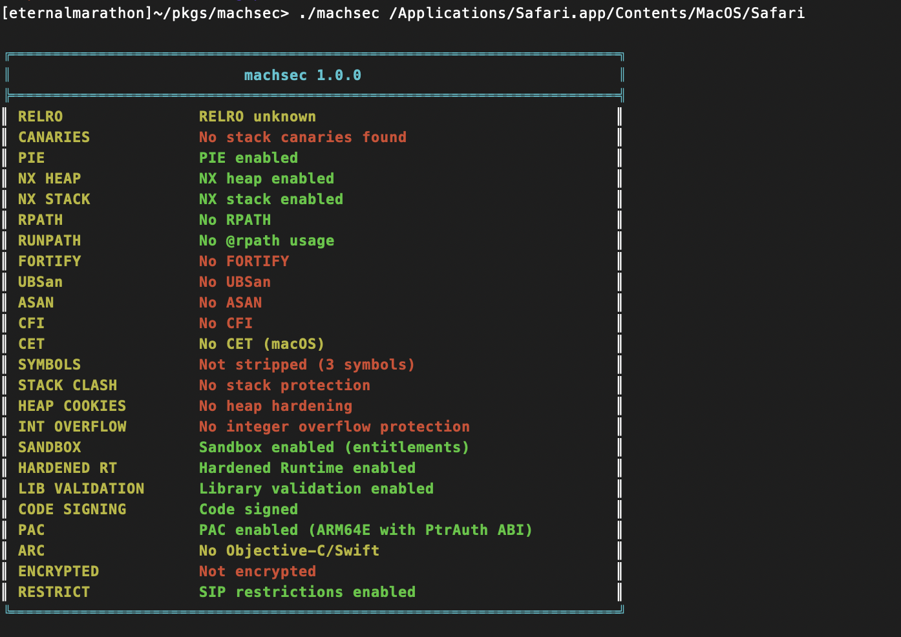

<div align="center">
  

  # machsec

  **A comprehensive binary security analysis tool for macOS and iOS**

  [](LICENSE)
  [](#)
  [](#)
  [](#testing)

  ---

  **machsec** detects and reports security mitigations in Mach-O executables with comprehensive support for Apple platform-specific security features. Originally designed for ELF binaries, it has been fully ported and enhanced for macOS and iOS environments.
</div>

### Example Output

<div align="center">
  
  <p><em>Sample security analysis output showing comprehensive mitigation detection</em></p>
</div>

## 🔍 Features

**machsec** provides comprehensive analysis of security mitigations across multiple categories:

<details>
<summary><strong>🛡️ Core Memory Protection</strong></summary>

- **RELRO** (Relocation Read-Only) - Limited support on macOS due to Mach-O format differences
- **Stack Canaries** - Stack smashing protection via compiler-generated canaries with symbol and disassembly detection
- **NX Bit** (No-eXecute) - Non-executable stack/heap protection (enabled by default on modern macOS)
- **PIE** (Position Independent Executable) - Address space layout randomization support

</details>

<details>
<summary><strong>🔐 Runtime & Path Security</strong></summary>

- **RPATH/RUNPATH** - Dynamic library search path security analysis with @rpath detection
- **FORTIFY_SOURCE** - Enhanced bounds checking for standard library functions
- **Symbol Stripping** - Binary obfuscation and debugging information removal

</details>

<details>
<summary><strong>🚀 Advanced Modern Mitigations</strong></summary>

- **UBSan** (Undefined Behavior Sanitizer) - Runtime undefined behavior detection
- **ASAN** (Address Sanitizer) - Memory error detection
- **Control Flow Integrity (CFI)** - Modern ROP/JOP attack prevention
- **Intel CET** (Control-flow Enforcement Technology) - Not available on macOS (Intel x86-specific)
- **Stack Clash Protection** - Large stack allocation attack prevention
- **Heap Hardening** - Heap corruption detection mechanisms
- **Integer Overflow Protection** - Arithmetic overflow detection

</details>

<details>
<summary><strong>🍎 Apple Platform-Specific Features</strong></summary>

- **Sandbox** (App Sandbox) - macOS/iOS application sandboxing with entitlement analysis
- **Hardened Runtime** - macOS runtime hardening protections
- **Library Validation** - Ensures only system-signed libraries can be loaded
- **Code Signing** - Binary signature verification for macOS/iOS
- **PAC** (Pointer Authentication Code) - ARM64 hardware-assisted code integrity for Apple Silicon and iOS devices
- **MIE/EMTE** (Memory Integrity Enforcement / Enhanced Memory Tagging Extension) - ARM64 memory tagging instruction detection for iOS 26+

</details>

## 📦 Installation

### Prerequisites

<table>
<tr>
<td><strong>System Requirements</strong></td>
<td>macOS 10.15+ or iOS development environment</td>
</tr>
<tr>
<td><strong>Development Tools</strong></td>
<td>Xcode Command Line Tools</td>
</tr>
<tr>
<td><strong>Dependencies</strong></td>
<td>Capstone disassembly engine</td>
</tr>
</table>

### Quick Setup

```bash
# 1. Install Xcode Command Line Tools
xcode-select --install

# 2. Install Capstone disassembly engine
brew install capstone

# 3. Clone and build
git clone <repository-url>
cd machsec
make

# 4. Verify installation
make test
```

### Optional System Installation

```bash
# Install globally (requires sudo)
sudo make install
```

## 🚀 Usage

### Basic Commands

```bash
# Analyze system binaries
./machsec /bin/ls
./machsec /usr/bin/ssh

# Check macOS applications
./machsec /Applications/Safari.app/Contents/MacOS/Safari
./machsec /System/Applications/Calculator.app/Contents/MacOS/Calculator

# Analyze custom binaries
./machsec ./your-binary
./machsec /path/to/ios/app
```


### Understanding Results

| Status | Meaning | Action Required |
|--------|---------|----------------|
| 🟢 **Green** | Security feature enabled | ✅ Good configuration |
| 🟡 **Yellow** | Partial/Unknown/Platform-specific | ⚠️ Review recommended |
| 🔴 **Red** | Security feature disabled | ❌ Mitigation needed |

## 🆚 Tool Comparison

<details>
<summary><strong>📊 Feature Comparison Matrix</strong></summary>

| Feature | **machsec** | checksec.rs | checksec-js | Traditional checksec |
|---------|-------------|-------------|-------------|----------------------|
| **🖥️ Platform Support** |
| macOS/iOS Mach-O | ✅ **Full support** | ✅ Basic | ✅ Basic | ❌ Linux only |
| Multi-architecture | ✅ **x86_64, ARM64, Universal** | ✅ Multi-platform | ✅ Multi-platform | ❌ Limited |
| **🛡️ Basic Mitigations** |
| RELRO | ✅ Mach-O segment analysis | ✅ Basic | ✅ Basic | ✅ ELF-specific |
| Stack Canaries | ✅ **Symbol + disassembly** | ✅ Symbol-based | ✅ Symbol-based | ✅ Symbol-based |
| NX/DEP | ✅ Mach-O segments | ✅ Basic | ✅ Basic | ✅ ELF segments |
| PIE/ASLR | ✅ **Mach-O + fat binary** | ✅ Basic | ✅ Basic | ✅ ELF headers |
| **🚀 Advanced Features** |
| Control Flow Integrity | ✅ **Symbol detection** | ❌ Limited | ❌ Limited | ❌ Not supported |
| Sanitizers (UBSan/ASAN) | ✅ **Comprehensive** | ❌ Limited | ❌ Limited | ❌ Not supported |
| Stack Clash Protection | ✅ **Advanced detection** | ❌ Not supported | ❌ Not supported | ❌ Not supported |
| **🍎 Apple-Specific** |
| Sandbox Detection | ✅ **Entitlement parsing** | ❌ Not supported | ❌ Not supported | ❌ Not supported |
| Hardened Runtime | ✅ **Full detection** | ❌ Not supported | ❌ Not supported | ❌ Not supported |
| PAC (Pointer Auth) | ✅ **ARM64E detection** | ❌ Not supported | ❌ Not supported | ❌ Not supported |
| **⚡ Technical** |
| Detection Method | **Static + disassembly + entitlements** | Static analysis | Static analysis | Symbol table only |
| Test Coverage | ✅ **100% (30/30 tests)** | ❌ Limited | ❌ Limited | ❌ Basic |

</details>

### 🎯 Key Advantages

| Advantage | Description |
|-----------|-------------|
| 🍎 **Apple Platform Focus** | Only tool with comprehensive macOS/iOS-specific feature detection |
| 🏗️ **Multi-Architecture** | Handles Universal binaries with intelligent architecture selection |
| 🔬 **Advanced Detection** | Combines symbol analysis, disassembly, and entitlement parsing |
| ✅ **Comprehensive Testing** | 30 test cases ensuring 100% detection accuracy |
| 🆕 **Modern Security** | Supports latest Apple Silicon PAC technology |

## 🏗️ Architecture Support

<div align="center">

| Architecture | Platform | Status |
|--------------|----------|---------|
| **x86_64** | Intel Macs | ✅ Full Support |
| **ARM64** | Apple Silicon, iOS | ✅ Full Support |
| **ARM32** | Legacy iOS | ✅ Full Support |
| **Universal** | Multi-arch binaries | ✅ Smart Selection |

</div>

> **Smart Architecture Selection**: Automatically detects and analyzes the optimal architecture, with ARM64 preference for Universal binaries.

## 🧪 Testing & Validation

### Test Suite Overview

**machsec** includes comprehensive test coverage to ensure detection accuracy:

```bash
# Run complete test suite
make test
```

<div align="center">

### 📊 Test Results

```
Test Execution Statistics:
├─ Total Tests Run: 30
├─ Tests Passed: 30  ✅
├─ Tests Failed: 0   ✅
└─ Success Rate: 100% 🎯
```

</div>

### Test Categories

| Test Type | Description | Coverage |
|-----------|-------------|----------|
| **✅ Positive Tests** | Binaries with security features enabled | Feature detection |
| **❌ Negative Tests** | Binaries with security features disabled | Absence detection |
| **🔍 System Validation** | Real-world macOS binary analysis | Production accuracy |

## ⚙️ Technical Implementation

### 🔬 Detection Methods

<div align="center">

| Method | Technology | Purpose |
|--------|------------|---------|
| **Static Analysis** | Mach-O Parser | Load commands, segments, symbols |
| **Disassembly** | Capstone Engine | ARM64/x86_64 instruction analysis |
| **Entitlements** | Code Signature Parser | Apple platform security features |
| **Multi-Arch** | Fat Binary Handler | Universal binary intelligence |

</div>

### 🏗️ Code Architecture

```
src/
├── detect.c      # 🧠 Core security detection engine
├── table.c       # 🎨 Formatted output & color coding
├── main.c        # 🚀 Mach-O parsing & orchestration
└── tests/        # ✅ 30 comprehensive test cases
```

### 🔧 Key Technologies

- **Capstone Disassembler** - Multi-architecture instruction analysis
- **Mach-O Parser** - Native Apple binary format support
- **Code Signature API** - Entitlement and signing validation

## 📋 Platform Notes

### ⚠️ macOS Limitations

| Feature | Status | Reason |
|---------|--------|---------|
| **RELRO** | Limited | Mach-O format differences from ELF |
| **Intel CET** | N/A | Intel x86-specific, not available on macOS |
| **SECCOMP** | N/A | Linux-specific syscall filtering |

### 🍎 Apple Silicon & iOS Features

| Feature | Support Level | Details |
|---------|---------------|---------|
| **PAC** | ✅ Full | ARM64E Pointer Authentication detection |
| **Sandbox** | ✅ Advanced | Entitlement-based analysis |
| **Code Signing** | ✅ Native | Mach-O signature verification |
| **Hardened Runtime** | ✅ Complete | Runtime protection analysis |

---

## 📈 Development Status

### ✅ Current State
- **All features implemented** with 100% test coverage
- **Production ready** for security analysis workflows
- **Actively maintained** with regular updates

### 🆕 Recent Additions
- MIE/EMTE (Memory Integrity Enforcement) detection for iOS 26+ binaries
- ARM64E/Pointer Authentication Code (PAC) detection
- Enhanced sandbox detection with entitlement parsing
- Universal binary support with architecture preference
- Comprehensive positive/negative test coverage

---

## 🤝 Contributing

**machsec** is focused on **defensive security analysis**. Contributions should maintain this focus on:

- ✅ Legitimate security research
- ✅ System hardening applications
- ✅ Binary security analysis
- ✅ Apple platform security features

---

## 📄 License

Released under open source license for security research and system administration use.

<div align="center">

  ---

  **Made with ❤️ for the macOS/iOS security community**

  ⭐ Star this project if you find it useful!

</div>
